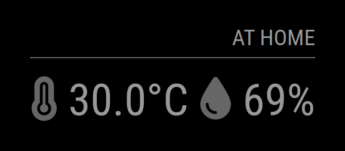

# Module: MMM-DHT-Sensor
This module displays the current temperature and humidity form DHT11, DHT22 and AM2302 sensors. It's a global rewrite of https://github.com/ryck/MMM-DHT-Sensor



[MagicMirror Project on Github](https://github.com/MichMich/MagicMirror)

## Installation:

In your terminal, go to your MagicMirror's Module folder:
```shell
cd ~/MagicMirror/modules
```

Clone this repository:
```shell
git clone https://github.com/grenagit/MMM-DHT-Sensor
```

Go to your MMM-DHT-Sensor's Module folder:
```shell
cd ~/MagicMirror/modules/MMM-DHT-Sensor
```

Install dependencies:
```shell
npm install
```

Configure the module in your config.js file.

## Update:

In your terminal, go to your MMM-DHT-Sensor's Module folder:
```shell
cd ~/MagicMirror/modules/MMM-DHT-Sensor
```

Incorporate changes from this repository:
```shell
git pull
```

Install dependencies:
```shell
npm install
```

## Configuration:

### Basic configuration

To use this module, add it to the modules array in the `config/config.js` file:
```javascript
modules: [
	{
		module: "MMM-DHT-Sensor",
		position: "top_left",
		config: {
			sensorPin: 2,
    	sensorType: 11, // 11 for DHT11 or 22 for DHT22 / AM2302
		}
	}
]
```

### Options

The following properties can be configured:

| Option                       | Description
| ---------------------------- | -----------
| `sensorPin`                  | The [GPIO pin](https://pinout.xyz/) of the sensor. <br><br> This value is **REQUIRED**
| `sensorType`                 | The sensor type (DHT11, DHT22 or AM2302).<br><br> This value is **REQUIRED**
| `units`                      | What units to use. Specified by config.js <br><br> **Possible values:** `config.units` = Specified by config.js, `metric` = Celsius, `imperial` = Fahrenheit <br> **Default value:** `config.units`
| `updateInterval`             | How often does the content needs to be fetched? (Milliseconds) <br><br> **Possible values:** `1000` - `86400000` <br> **Default value:** `1 * 60 * 60 * 1000` (1 hour)
| `animationSpeed`             | Speed of the update animation. (Milliseconds) <br><br> **Possible values:**`0` - `5000` <br> **Default value:** `1000` (1 second)
| `relativeScale`              | Relative scale to choose the temparature icon. <br><br> **Possible values:** `true` (round to integer) or `false` (display exact value with decimal point) <br> **Default value:** `false`
| `roundTemp`                  | Round temperature value to nearest integer. <br><br> **Possible values:** `1` - `100` <br> **Default value:** `30`
| `initialLoadDelay`           | The initial delay before loading. If you have multiple modules that use the same API key, you might want to delay one of the requests. (Milliseconds) <br><br> **Possible values:** `1000` - `5000` <br> **Default value:**  `0`
| `retryDelay`                 | The delay before retrying after a request failure. (Milliseconds) <br><br> **Possible values:** `1000` - `60000` <br> **Default value:**  `2500` (2,5 seconds)                                                                                                                                       |

## Notifications

This module implements the following notifications:

- **INDOOR_TEMPERATURE** (int) Temperature in Celsius
- **INDOOR_HUMIDITY** (int) Humidity in relative humidity (%)

## License:

This module is licensed under the MIT License
